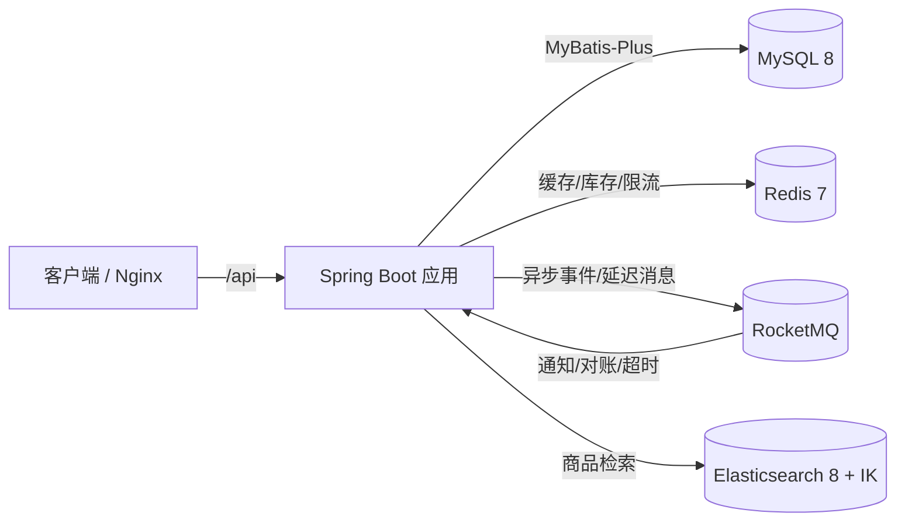

# 鲜迹 FreshTrace

生鲜农产品溯源交易平台后端。面向「果农 ↔ 买家」双边场景，覆盖认证入驻、商品上架审核、
搜索、下单支付、履约评价、溯源、社区、预售、即时通讯、站内通知与管理后台的完整闭环。

- **技术栈**：Java 21 · Spring Boot 4.0.8 · MyBatis-Plus 3.5.17 · MySQL 8 · Redis 7 · RocketMQ 5.3 · Elasticsearch 8.13 (IK) · WebSocket · springdoc-openapi 3.1
- **形态**：模块化单体（按业务分包），Docker 一键部署

---

## 1. 功能模块

| 模块 | 能力 |
|------|------|
| 用户体系 | 注册/登录/刷新/登出、JWT 无状态鉴权、收货地址、果农认证申请与审核（买家/果农互斥） |
| 商品中心 | 品类 / SPU / SKU 模型、商品生命周期状态机、审核上架、ES + IK 多字段搜索、详情 Redis 缓存、热销 Top100 |
| 交易中心 | 购物车、Redis Lua 原子预扣库存、按果农拆单（主订单+子订单）、价格/规格快照、模拟支付、取消退款、30min 超时取消 |
| 履约评价 | 卖家发货、确认收货 / 7 天自动确认、状态条件更新抢占、四重校验评价、果农回复 |
| 溯源系统 | 溯源节点管理、按品类模板批量生成、时间线公开接口、发生时间与录入时间分离 |
| 动态社区 | 果农图文动态、点赞、嵌套评论、果农主页聚合 |
| 预售系统 | 预约提醒型预售（免费预约/不锁价/不生成订单）、预约上限、到期转销售中 |
| 即时通讯 | 原生 WebSocket + 握手 JWT 鉴权、会话与消息落库、离线留存、游标分页、已读与未读 |
| 消息通知 | MySQL → MQ → 消费入库的站内信，`dedup_key` 幂等，果农/买家/预售三路事件 |
| 管理后台 | 果农与商品审核、退款仲裁、举报处理、运营仪表板（Redis 缓存）、AOP 操作日志 |

---

## 2. 系统架构



核心原则：**MySQL 为唯一事实来源**；Redis 承担热点缓存与库存原子操作；ES 承担检索；
RocketMQ 承担事务提交后的异步事件与延迟任务；定时任务对所有异步链路兜底。

---

## 3. 技术亮点

- **下单事务边界**：Redis Lua 原子预扣库存 → MySQL 本地事务内建主/子订单与快照 → 事务提交后发 MQ（超时取消/通知/ES 同步），失败整体回滚。
- **并发控制**：支付/发货/收货/取消统一使用 `WHERE status=旧值` 条件更新抢占，状态单调推进不回退；商品编辑用 `@Version` 乐观锁。
- **最终一致性**：MySQL 本地事务 + Redis Lua + MQ + 定时对账（库存/预售计数/自动确认收货双重兜底）。
- **搜索**：应用层双写同步 MySQL → MQ → ES，索引 mapping 使用 `ik_max_word`，多字段加权 + 分类筛选 + 价格/销量/评分排序。
- **缓存**：商品详情读时回写 TTL 1h、变更删除；热销 ZSET 按销量 Top100 定时重建；仪表板聚合缓存。
- **安全**：JWT 无状态 + Redis 黑名单踢人、BCrypt 密码、身份证 AES 加密、`@RoleRequired`/`@FarmerRequired` 注解 + AOP 鉴权。
- **通知解耦**：业务模块只发 MQ，通知模块统一消费入库，`dedup_key` 唯一索引保证幂等。

---

## 4. 快速开始（开发环境）

### 4.1 前置

- Docker Desktop（含 Compose v2）
- JDK 21（项目自带 Maven Wrapper，无需单独装 Maven）

### 4.2 启动中间件

```powershell
# 首次会构建带 IK 插件的 ES 镜像
docker compose up -d --build
```

| 服务 | 地址 |
|------|------|
| MySQL | localhost:3307（root/root，库 `freshtrace`） |
| Redis | localhost:6379 |
| Elasticsearch | http://localhost:9200 |
| RocketMQ NameServer | localhost:9876 |

### 4.3 初始化数据库

```powershell
Get-ChildItem sql\*.sql | Sort-Object Name | ForEach-Object {
    Get-Content $_.FullName -Raw -Encoding UTF8 |
        docker exec -i freshtrace-mysql mysql -uroot -proot --default-character-set=utf8mb4 freshtrace
}
```

### 4.4 启动应用

```powershell
.\mvnw.cmd spring-boot:run
```

- 健康检查：`GET http://localhost:8080/api/health`
- API 文档：`http://localhost:8080/api/swagger-ui/index.html`
- 注册用户默认 `role=0`；需要管理员时手动提权：`UPDATE t_user SET role=1 WHERE username='xxx';`

### 4.5 运行测试

测试依赖本机 MySQL(3307)/Redis/ES/RocketMQ（`test` profile 默认关闭 MQ 与 ES，仅对应专项测试会打开）。
测试库为 `freshtrace_test`，建表脚本自动执行。

```powershell
.\mvnw.cmd test
```

---

## 5. 生产部署

```powershell
copy .env.example .env   # 填写 MYSQL_ROOT_PASSWORD / JWT_SECRET / AES_KEY
docker compose -f docker-compose.prod.yml up -d --build
```

- `Dockerfile`：多阶段构建（Maven 构建 → JRE 运行），运行镜像仅含 JRE 与 jar。
- `docker-compose.prod.yml`：app + nginx + MySQL/Redis/ES/RocketMQ；中间件不暴露宿主端口。
- `docker/nginx/default.conf`：反向代理 `/api`，并透传 WebSocket Upgrade（`/api/ws/chat`）。
- 生产配置强制从环境变量注入 `JWT_SECRET` / `AES_KEY`，缺失则启动失败。

> 注意：生产编排与开发编排使用相同的容器名与数据卷，二者不可同时启动。

---

## 6. 项目结构

```
src/main/java/com/freshtrace
├── common/          # R 响应体、异常、JWT/AES、Redis Lua、MQ 封装、缓存 Key
├── config/          # Security / MyBatis-Plus / CORS / ES / OpenAPI / 调度
├── security/        # JWT Filter、UserContext、@RoleRequired、@FarmerRequired
├── user/            # 用户与地址
├── farmer/          # 果农认证与审核
├── product/         # 品类/SPU/SKU、生命周期、search(ES)、缓存、热销
├── trade/           # 购物车、订单、支付、取消/退款、库存对账
├── fulfillment/     # 发货、收货、自动确认
├── review/          # 评价与回复
├── trace/           # 溯源节点与模板
├── community/       # 动态、评论、点赞、果农主页
├── presale/         # 预售与预约
├── im/              # WebSocket 会话与消息
├── notification/    # 站内信
├── report/          # 举报
└── admin/           # 管理后台（审核/仲裁/仪表板/操作日志）
```

配套设计文档（仓库外）：PRD、数据库设计（29 张表）、系统架构设计、开发计划、Pre-Mortem。

---

## 7. 已知限制

- 图片上传链路未接入 HTTP 端点（`LocalFileStorageService` 已实现但无 Controller），当前图片以 URL 形式传入。
- ES 无存量数据重建入口，历史商品需经编辑/审核/订单事件触发增量同步。
- 支付为模拟实现；IM 单实例部署，分布式需 Redis Pub/Sub 广播。
